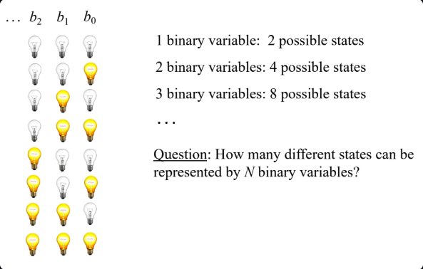
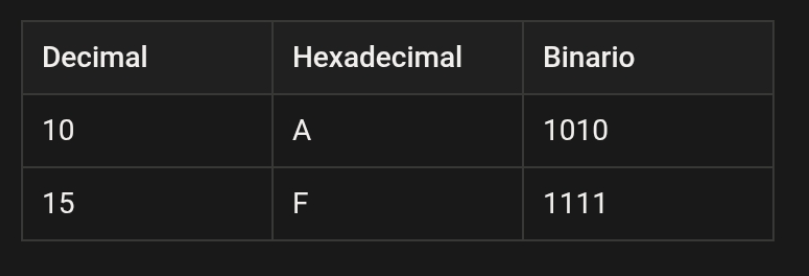
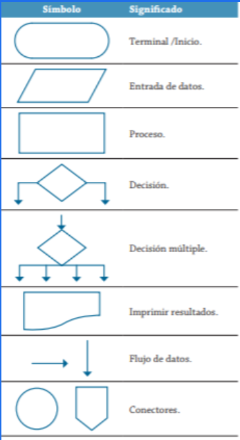
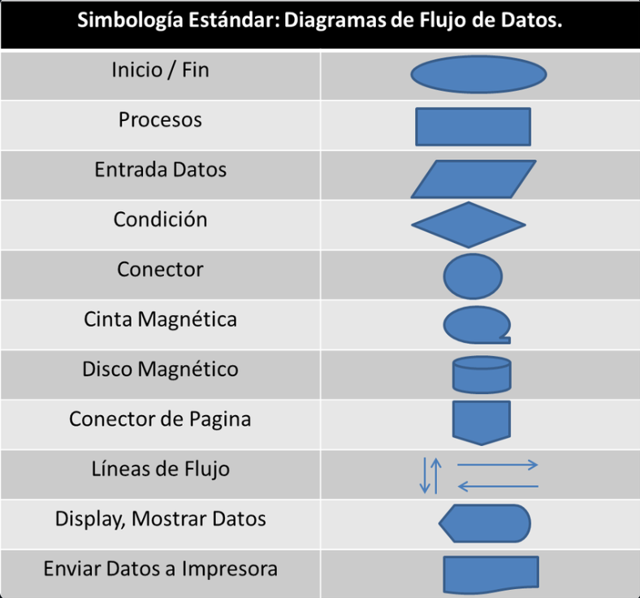

# CLASE 28 julio 2026

Decimal: 13
Binario: 1101

13 / 2 = 6, resido 1
6  ÷ 2 = 3, residuo 0
3  ÷ 2 = 1, residuo 1
1  ÷ 2 = 0, residuo 1

## Ejemplo:

- 87 ÷ 2 = 43, residuo 1
- 43 ÷ 2 = 21 , residuo 1
- 21 ÷ 2 = 10 , residuo 1
- 10 ÷ 2 = 5 , residuo 0
- 5 ÷ 2 = 2 , residuo 1
- 2 ÷ 2 = 1 , residuo 0
- 1 ÷ 2 = 0 , residuo 1
- 0

## Nota:

- 87 en base 10 = 01010111 en base 2

## Ejemplo 2:

- | 128 | 64 | 32 | 16 | 8 | 4 | 2 | 1 |
- |  0  |  1 |  1 |  0 | 0 | 1 | 0 | 0 |

- 'A' = 65 = 01000001 (en binario) → almacenado en 1 byte.

- |  0  |  1 |  1 |  1 | 1 | 1 | 1 | 1 |base 2 = 127
- |  1  |  0 |  0 |  0 | 0 | 0 | 0 | 1 | = -127

## Complementos:

- 000 = 111
- 001 = 110
- 010 = 101
- 011 = 100
- 100 = 011
- 101 = 010
- 110 = 001
- 111 = 000

**De binario a decimal:**

Para convertir 1011 a decimal:

$1*(2^3) + 0*(2^2) + 1*(2^1) + 1*(2^0) = 8 + 0 + 2 + 1 = 11$

### Ejercicios

1. Convierte el número decimal 22 a binario.
2. ¿Cuál es el resultado en decimal del número binario 10110?

### Solución:

1)
- 22 ÷ 2 = 11, residuo 0
- 11 ÷ 2 = 5 , residuo 1
- 5 ÷ 2 = 2 , residuo 1
- 2 ÷ 2 = 1 , residuo 0
- 1 ÷ 2 = 2 , residuo 1
- 0

= 10110

2)

$1*(2^4) + 0*(2^3) + 1*(2^2) + 1*(2^1)+ 0*(2^0) = 16 + 0 + 4 + 2 + 0 = 22$

## Ejercicio 1

En la Figura 2 se muestran los diferentes estados que se pueden representar usando una palabra binaria de 3 bits. Responde la pregunta de la imagen: ¿Cuántos estados diferentes se pueden representar usando N bits?

Para resolver el ejercicio anterior, intenta con 2 bits, luego con 3 y así sucesivamente. Intenta encontrar una representación matemática para dicha secuencia. 

### Ejercicios

1. ¿Qué número binario representa el carácter 'C' en ASCII?
2. Convierte el número flotante 5.75 a binario (explica los pasos).

### Solución:

1. El carácter 'C' en ASCII corresponde al número decimal 67.

Convertimos 67 a binario:

\[
67 = 64 + 2 + 1
\]

Por lo tanto:

C = $01000011_{2}$

2. Para convertir 5.75 a binario, separamos la parte entera y la decimal.

### 1. Parte entera: 5
- Dividimos entre 2:

5 ÷ 2 = 2, residuo 1
2 ÷ 2 = 1, residuo 0
1 ÷ 2 = 0, residuo 1

Leyendo los residuos de abajo hacia arriba:

$5_{10} = 101_{2}$

### 2. Parte decimal: 0.75
- Multiplicamos por 2 y tomamos la parte entera:

0.75 × 2 = 1.5 → parte entera 1
0.5 × 2 = 1.0 → parte entera 1

Entonces:

$0.75_{10} = 0.11_{2}$

### 3. Unimos ambas partes

$5.75_{10} = 101.11_{2}$

### Resultado final:

$5.75_{10} = 101.11_{2}$

### Ejercicios

1. ¿Cuántos bytes se necesitan para almacenar la palabra “Hola” en ASCII?
2. ¿Cuántos bits hay en 5 KB?

### Solución:

1. En ASCII, C = 67 en decimal.
Convertimos 67 a binario:

67 = 64 + 2 + 1

67 =   $1*(2^6) + 1*(2^1) + 1*(2^0) = 64 + 2 + 1 = 67_{10} = 01000011_2$

2. Convierte el número flotante 5.75 a binario

- Separamos la parte entera y la parte decimal:
- Parte entera: 5
- Dividimos entre 2:

5 ÷ 2 = 2, residuo 1
2 ÷ 2 = 1, residuo 0
1 ÷ 2 = 0, residuo 1

Leyendo los residuos de abajo hacia arriba:

$5_{10} = 101_{2}$

- Parte decimal: 0.75
- Multiplicamos por 2: 0.75 x 2 = 1.5
- Tomamos el 1 y continuamos con 0.5: 0.5 x 2 = 1.0
- Tomamos el 1 y por lo tanto: $0.75_{10} = 0.11_{2}$
- Unimos ambas partes: $5.75_{10} = 101.11_{2}$
- Respuesta: 101.11

### Almacenamiento Digital de Datos

### ¿Cómo se almacenan los datos?

Los datos se almacenan en la memoria y en dispositivos de almacenamiento como secuencias de bits. La unidad básica es el **bit**, pero normalmente se agrupan en **bytes** (8 bits).

- **Palabra:** Unidad de datos que maneja el procesador (puede ser 16, 32 o 64 bits).
- **Unidades de almacenamiento:** 1 byte = 8 bits, 1 KB = 1024 bytes, 1 MB = 1024 KB, etc.

**Diagrama de almacenamiento:**

|--bit--|--bit--|--bit--|--bit--|--bit--|--bit--|--bit--|--bit--|
|------------------------- 1 byte ------------------------------|

**Ejemplo:**
Guardar la letra 'A' en memoria:

- 'A' = 65 = 01000001 (en binario) → almacenado en 1 byte.

### Ejercicios

1. ¿Cuántos bytes se necesitan para almacenar la palabra “Hola” en ASCII?
2. ¿Cuántos bits hay en 5 KB?

### Solución:

1. La palabra “Hola” tiene 4 caracteres:
H → 1 byte
o → 1 byte
l → 1 byte
a → 1 byte

Entonces:

4 caracteres x 1 byte = 4 bytes

Respuesta: 4 bytes

2. Usando: 1KB = 1024 bytes
- Y como 1 byte = 8 bits
- Tenemos: 5120 x 8 = 40960 bits

Respuesta: 40.960 bits

### tras Temáticas Relevantes

### Sistema hexadecimal

El sistema hexadecimal (base 16) es usado frecuentemente para representar datos binarios de forma más compacta.

**Conversión:**

- 1111 1111 (binario) = FF (hexadecimal)
- 1010 1100 (binario) = AC (hexadecimal)

### Errores de redondeo y precisión

En los números de punto flotante, no todos los números decimales pueden representarse exactamente, lo que provoca errores de redondeo.

### Codificación de colores

Colores en computadoras suelen representarse en formato RGB, usando valores hexadecimales:

- Rojo: #FF0000
- Verde: #00FF00
- Azul: #0000FF

### Ejercicios

1. Convierte el número decimal 255 a hexadecimal.
2. ¿Cuál es el valor hexadecimal de la secuencia binaria 11010110?

### Solución:

1. Dividimos entre 16: 255 ÷ 16 = 155, residuo 15

- En Hexadecimal: 15 = F
- Entonces:
$255_{10}$ = $FF_{16}$
- Respuesta: FF

2. Separamos el número binario en grupos de 4 bits:

- 1101 y 1010

Convertimos cada grupo:

- $1101_{2}$ = $13_{10}$ = $D_{16}$

Por lo tanto:

$11010110_{2}$ = $DA_{16}$

Respuesta: DA

## Ejercicios Finales de Repaso

1. Explica, en tus propias palabras, por qué es necesario que las computadoras representen los datos en binario.
2. Convierte el número binario 10011011 a decimal y a hexadecimal.
3. Investiga y describe cómo se representa una imagen en formato PNG en el disco.
4. Analiza la siguiente situación: ¿Qué sucede si intentas almacenar un número mayor al que puede representar un byte (por ejemplo, 300)? ¿Cómo lo maneinstrucció

### Solución:

1. Las computadoras utilizan binario porque sus componentes electrónicos trabajan principalmente con dos estados, que se pueden representar como 0 y 1. Con estos dos valores pueden representar números, letras, imágenes, sonidos y cualquier otro tipo de información.

2. ### A decimaal:

$10011011_{2}$  =  $1*(2^7) + 0*(2^6) + 0*(2^5) + 1*(2^4) + 1*(2^3) + 0*(2^2) + 1*(2^1)+ 1*(2^0) = 128 + 16 + 8 + 2 + 1 = 155$

Por lo cual:

$10011011_{2}$  =   $155_{10}$

### A Hexadecimal:

Separamos en grupos de 4:

- 1001 y 1011
- 1001 = 9
- 1011 = B

Por lo tanto:

$10011011_{2}$ = $9B_{16}$

Respuesta: 155 en decimal y 9B en hexadecimal

3. Una imagen PNG se almacena en el disco como un archivo formado por datos binarios. En este, el archivo contiene información sobre la imagen como su ancho, alto, colores y otros datos, además de los datos de los píxeles.
- La PNG utiliza compresión sin pérdida, por lo que puede reducir el tamaño del archivo sin perder información de la imagen. Entonces, cuando un programa abre el PNG, interpreta esos datos binarios y reconstruye la imagen para mostrarla en pantalla.
- En resumen, aunque nosotros vemos una imagen, en el disco realmente está almacenada como una secuencia de bytes (0 y 1).

4. Python puede manejar 300 como un entero normal, pero no puede representarlo en un solo byte sin utilizar más espacio, es decir, un byte puede representar valores de 0 a 255 cuando se utiliza sin signo.

Por ejemplo:

$255_{10}$   =   $11111111_{2}$

Pero 300 es mayor que 255, por lo que no cabe en un solo byte.
En Python, un número entero normal (int) no está limitado a un byte. Como resultado se produce un "OverflowError"

# Clase de Algoritmos:

## Símbolos que se utilizan para representar cada operación de un algoritmo con un diagrama de flujo:

## 1. Óvalo 
- Inicio/Fin: Se utiliza para indicar el comienzo y el final de un algoritmo. Todo diagrama de flujo debe iniciar y terminar con este símbolo.

## 2. Rectángulo 
- Proceso: Representa una acción, operación o cálculo que debe realizar el algoritmo, como sumar dos números, asignar un valor o ejecutar una instrucción.

## 3. Paralelogramo 
- Entrada de datos: Se utiliza para representar la entrada o salida de información. Generalmente indica que el usuario ingresa datos o que el sistema muestra un resultado.

## 4. Rombo 
- Condición: Representa una decisión o comparación. Dependiendo de si la condición es verdadera o falsa, el algoritmo sigue un camino diferente.

## 5. Círculo
- Conector: Sirve para unir diferentes partes del diagrama de flujo sin necesidad de trazar líneas muy largas, facilitando su organización y lectura.

## 6. Símbolo de cinta magnética 
- Cinta magnética: Representa el almacenamiento de datos en una cinta magnética. Es un símbolo tradicional que hoy en día se utiliza muy poco.

## 7. Cilindro 
- Disco magnético: Indica que la información se almacena en un disco duro o en una base de datos, es decir, en un medio de almacenamiento permanente.

## 8. Pentágono 
- Conector de página: Se utiliza cuando el diagrama continúa en otra hoja. Permite indicar dónde debe seguir el flujo del algoritmo.

## 9. Flechas 
- Líneas de flujo: Muestran la dirección y el orden en que se ejecutan las instrucciones dentro del diagrama de flujo.

## 10. Símbolo de pantalla o display 
- Mostrar datos: Representa la salida de información en un monitor o pantalla para que el usuario pueda visualizar los resultados.

## 11. Símbolo de documento 
- Enviar datos a impresora: Indica que la información generada por el algoritmo será enviada a una impresora o se obtendrá un documento impreso como salida.

   

  ## Reglas para el uso de diagramas de flujo:

1. Todo diagrama de flujo debe tener un **inicio y** un **fin.** 
2. Las líneas utilizadas para indicar la dirección del flujo del  diagrama deben ser rectas: verticales u horizontales. 
3. Todas las líneas utilizadas para indicar la dirección del flujo  del diagrama deben estar conectadas. La conexión puede  ser a un símbolo que exprese lectura, proceso, decisión,  impresión, conexión o fin del diagrama. 
4. El diagrama de flujo debe construirse de arriba hacia abajo  (*top-down*) y de izquierda a derecha (*left to right* ).
5. La notación utilizada en el diagrama de flujo debe ser  independiente del lenguaje de programación. 
6. Al realizar una tarea compleja, es conveniente poner  comentarios que expresen o ayuden a entender lo que  hayamos hecho. 
7. Si la construcción del diagrama de flujo requiriera más de  una hoja, debemos utilizar los conectores adecuados y  enumerar las páginas correspondientes. 
8. No puede llegar más de una línea a un símbolo  determinado.

