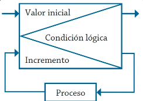
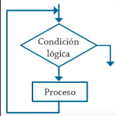
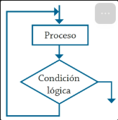
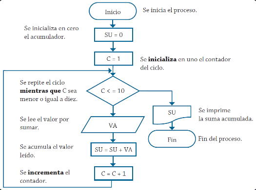
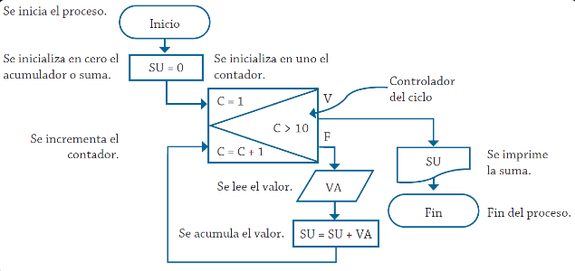
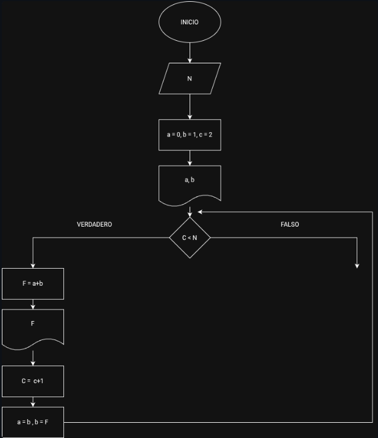
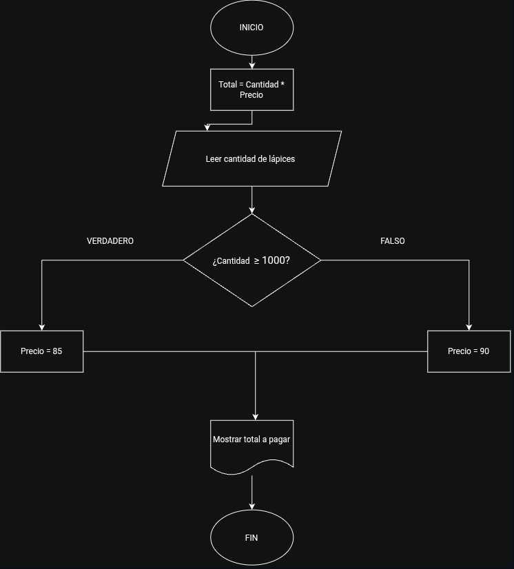
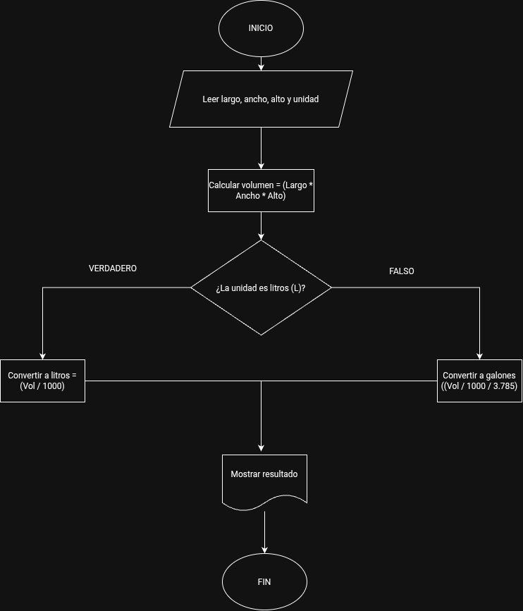
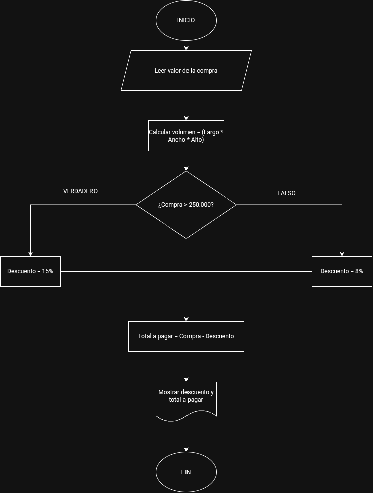
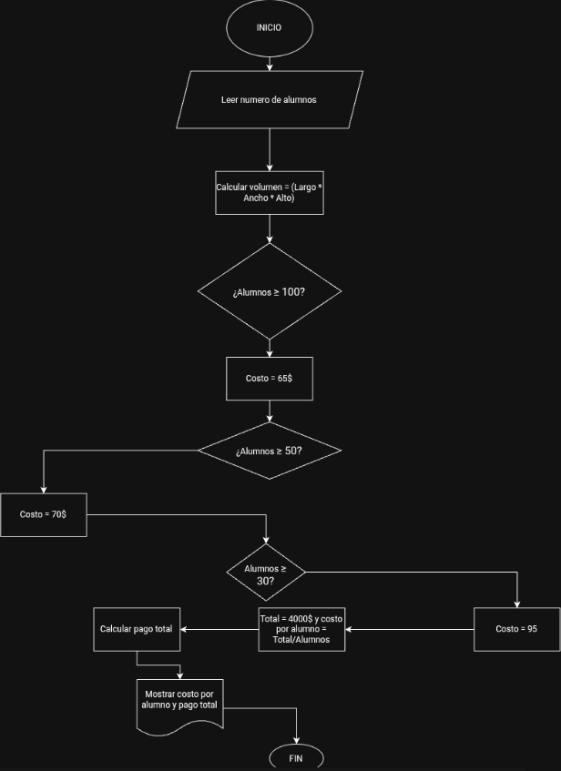

# Clase 06 de Agosto / 2026
1. For:
   

2. While
   

3. Do - While
   

 # Ejemplo 1

Contador:
- C = 0
- C = C + 1

Acumulador:
- Ac = 0 <- Suma
- Ac = Ac + N

# Ejemplo 2

# IMPORTANTE

¿Cual es la diferencia entre un acumulador y el contador?

# Ejemplo 3

# Ejercicios de diagramas de flujo

1. Realice un algoritmo para determinar cuánto se debe pagar por equis cantidad de lápices considerando que si son 1000 o más el costo es de $85 cada uno; de lo contrario, el precio es de $90. Represéntelo con el pseudocódigo y el diagrama de flujo.

2. Un acuario necesita determinar cuántos litros o galones (eso lo decide el usuario) de agua caben en un acuario, pero solo dispone de una cinta métrica (en centímetros). Diseña un algoritmo para solucionar el problema.

3. Un almacén de ropa tiene una promoción: por compras superiores a $250 000 se les aplicará un descuento de 15%, de caso contrario, sólo se aplicará un 8% de descuento. Realice un algoritmo para determinar el precio final que debe pagar una persona por comprar en dicho almacén y de cuánto es el descuento que obtendrá. Represéntelo mediante el pseudocódigo y el diagrama de flujo.

4. El director de una escuela está organizando un viaje de estudios, y requiere determinar cuánto debe cobrar a cada alumno y cuánto debe pagar a la compañía de viajes por el servicio. La forma de cobrar es la siguiente: si son 100 alumnos o más, el costo por cada alumno es de $65.00; de 50 a 99 alumnos, el costo es de $70.00, de 30 a 49, de $95.00, y si son menos de 30, el costo de la renta del autobús es de $4000.00, sin importar el número de alumnos.

# Actividad de Evaluación: Comprensión de Conceptos

## **Consigna tus respuestas en la bitácora**

A continuación, se presentan enunciados relacionados con los temas tratados en el texto. Los estudiantes deben responder si los enunciados corresponden o no con las definiciones o conceptos aprendidos.

### Parte 1: Identificar Algoritmos

Responde si los siguientes enunciados representan un algoritmo. Justifica la respuesta:

1. Una página web.
2. Una receta para hacer un pastel, donde se indican ingredientes y pasos a seguir.
3. "Piensa en un número y multiplícalo por otro".
4. Un manual de instrucciones para armar un mueble, con pasos detallados y un orden claro.
5. Una lista de compras organizada en orden alfabético

### Parte 2: Variables y Constantes

Indica si las siguientes afirmaciones describen una variable o una constante:

1. El valor de la gravedad en la Tierra, 9.8 m/s².
2. La edad de una persona calculada con base en el año actual y su año de nacimiento.
3. La cantidad de dinero en una cuenta bancaria.
4. La velocidad de la luz en el vacío, 299,792,458 m/s.
5. El radio de un círculo.

### Parte 3: Características de los Algoritmos

Responde si los siguientes enunciados cumplen con las características de un algoritmo. Justifica la respuesta:

1. Para elegir la ruta más corta entre varias ciudades, el algoritmo examina rutas candidatas, deteniéndose cuando los cambios en la distancia parecen lo suficientemente pequeños.
2. Suma los números ingresados y muestra el resultado.
3. Un conjunto de pasos para calcular el área de un rectángulo dado su base y altura.
4. El algoritmo cuenta el número de votos obtenidos por cada uno de los candidatos de una elección para presidente. Empieza solicitando el nombre del candidato y finaliza cuando se ingresa el valor -1.

### Parte 4: Comprensión de Herramientas

Indica si las siguientes afirmaciones son ciertas o falsas respecto al pseudocódigo y diagramas de flujo:

1. El pseudocódigo utiliza símbolos estándar para representar las operaciones lógicas.
2. Los diagramas de flujo son una representación gráfica de un algoritmo.
3. El pseudocódigo debe estar escrito en un lenguaje de programación específico.
4. Un diagrama de flujo siempre debe tener un inicio y un fin claramente definidos.

### Parte 5: Estructuras de Control

Describe para qué sirven las estructuras de control. Redacta dos ejemplos, uno de tu vida diaria, es decir cuando tienes que tomar decisiones en tus actividades diarias y otro ejemplo en el que se tengan que utilizar cálculos matemáticos para tomar una u otra decisión.

# SOLUCION

## PARTE 1: Identificar algoritmos

1. Una página web. No es un algoritmo. Es un producto o resultado algo como contenido estático o interactivo, no un conjunto ordenado de pasos para resolver un problema o realizar una tarea específica.
 
2. Una receta para hacer un pastel. Sí es un algoritmo. Tiene entradas claras como los ingredientes, una secuencia ordenada de pasos (mezclar, hornear, etc.) y un resultado final definido siendo el pastel, cumpliendo con las características de finitud y precisión.
  
3. "Piensa en un número y multiplícalo por otro". No es un algoritmo completo, porque es algo ambiguo ya que no especifica qué número pensar ni por cuál multiplicarlo, y le falta precisión y un resultado definido. Le faltan pasos y datos concretos.
 
4. Un manual de instrucciones para armar un mueble. Sí es un algoritmo. Tiene pasos detallados, un orden claro de secuencialidad, un punto de inicio y un resultado final el cual seria el mueble armado, cumpliendo todas las características esenciales.
 
5. Una lista de compras organizada alfabéticamente. No es un algoritmo por sí sola es una estructura de datos u organización de información. Sin embargo, el proceso de ordenarla alfabéticamente sí podría considerarse un algoritmo de ordenamiento.

## PARTE 2: Variables y Constantes

1. Gravedad en la Tierra (9.8 m/s²). Constante, porque su valor no cambia bajo las mismas condiciones físicas se usa como un valor fijo de referencia en cálculos.

2. Edad de una persona. Variable, ya que su valor cambia dependiendo de dos datos el año actual (que avanza) y el año de nacimiento, por lo que el resultado del cálculo no es fijo en el tiempo.

3. Dinero en una cuenta bancaria. Variable, porque su valor cambia constantemente según depósitos, retiros o intereses aplicados a lo largo del tiempo.

4. Velocidad de la luz (299,792,458 m/s). Constante, es un valor físico universal fijo que no cambia bajo ninguna circunstancia dentro del vacío.

5. Radio de un círculo. Variable, porque depende del círculo específico que se esté analizando cada figura puede tener un radio diferente.

## PARTE 3: Características de los Algoritmos

1. Ruta más corta con criterio de "cambios suficientemente pequeños". No cumple estrictamente con la característica de precisión y definición, porque "suficientemente pequeños" es un criterio ambiguo y subjetivo, no un valor exacto. Un algoritmo debe tener condiciones de parada claras y no ambiguas.

2. Sumar los números ingresados y mostrar el resultado. Sí cumple con las características de un algoritmo ya que tiene entradas definidas, un proceso claro (la suma) y una salida (el resultado), además de ser finito.

3. Calcular el área de un rectángulo. Sí cumple, ya que tiene entradas precisas (base y altura), una operación bien definida (base × altura) y un resultado único y finito.

4. Conteo de votos que finaliza con -1. Sí cumple, porque tiene un inicio claro (solicitar nombres), un proceso repetitivo bien definido y una condición de finalización precisa y no ambigua (ingresar -1).

## PARTE 4: Comprensión de Herramientas

1. Falso. El pseudocódigo usa lenguaje natural estructurado (palabras clave como "si", "mientras", "inicio"), no símbolos estándar los símbolos estandarizados corresponden a los diagramas de flujo, no al pseudocódigo.

2. Verdadero. Los diagramas de flujo son precisamente una representación gráfica que usa símbolos (óvalos, rectángulos, rombos, flechas) para mostrar visualmente la secuencia lógica de un algoritmo.

3. Falso. El pseudocódigo es independiente de cualquier lenguaje de programación su propósito es describir la lógica de forma comprensible , sin enfocarse a la sintaxis de un lenguaje específico como Python o Java.

4. Verdadero. Todo diagrama de flujo debe tener un símbolo de inicio y uno de fin claramente marcados (usualmente óvalos), ya que representan los límites del proceso que se está modelando.

## PARTE 5: Estructuras de Control

Las estructuras de control sirven para determinar el orden en que se ejecutan las instrucciones de un algoritmo, permitiendo tomar decisiones como estructuras selectivas, repetir acciones como estructuras repetitivas o simplemente seguir una secuencia lineal, según se cumplan o no ciertas condiciones.

EJEMPLO DE LA VIDA DIARIA: Cuando salgo de casa decido si llevar o no paraguas dependiendo si esta lloviendo o si pareciera que va a llover por lo que aplico una estructura simple ya si llueve o va a llover llevare el paraguas, si no, no lo llevare

EJEMPLO CON CALCULOS MATEMATICOS: Un banco decide si aprobar un prestamo evaluando si los ingresos mensuales de quien lo solicita superan cierto monto calculado, por ejemplo, 3 veces la cuota mensual del prestamo. Si el calculo da como resultado que los ingresos son suficientes se puede aprobar, si no, se rechaza
