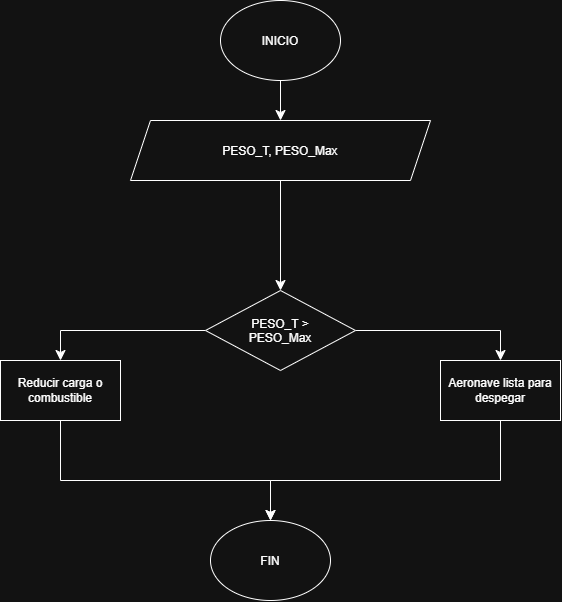
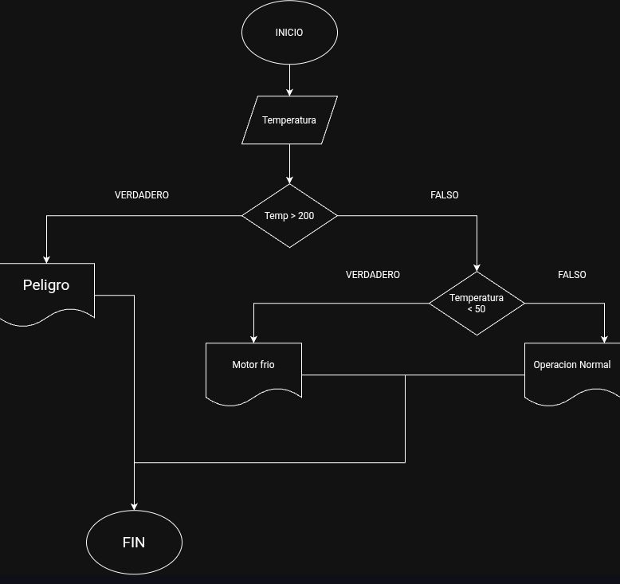
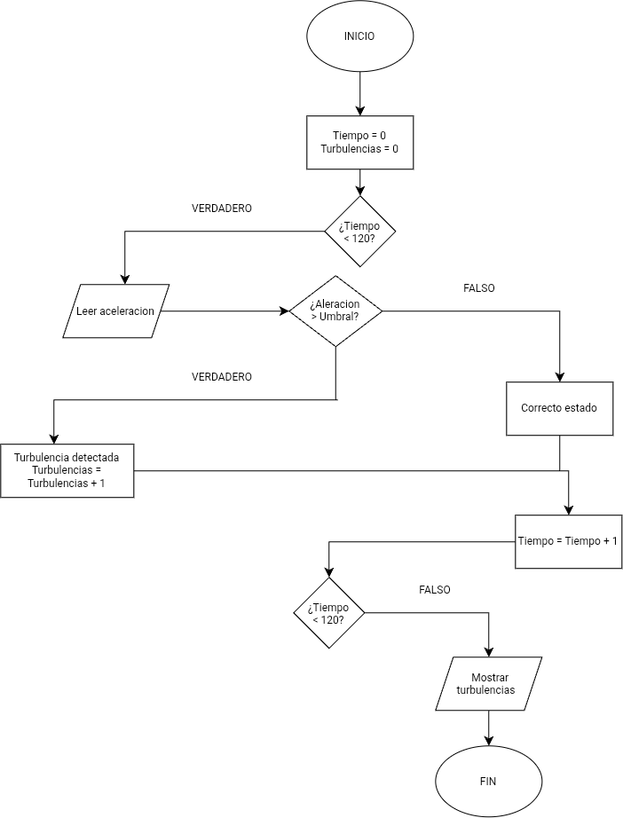
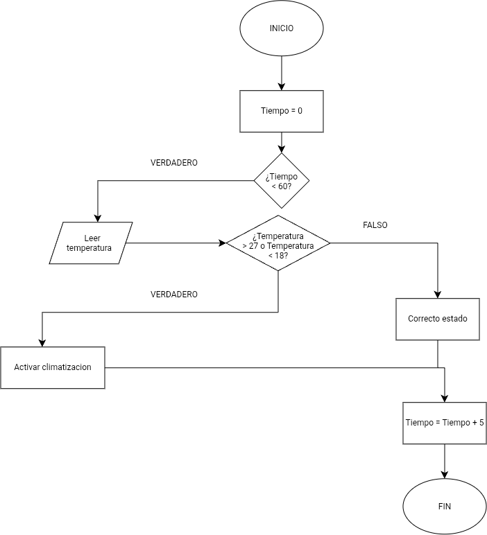
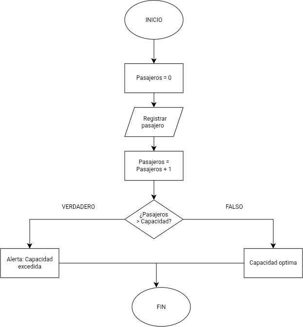
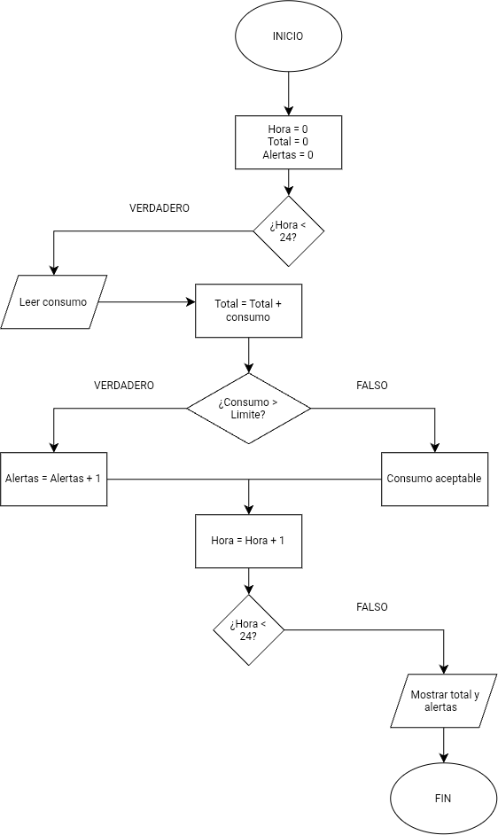
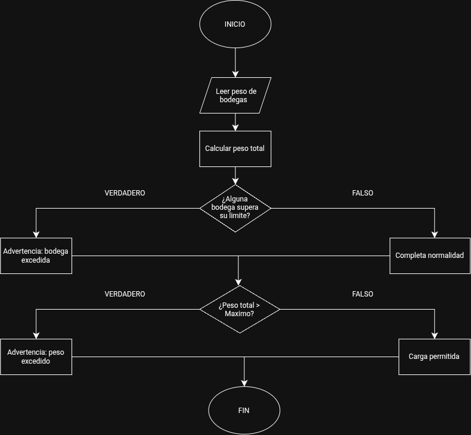
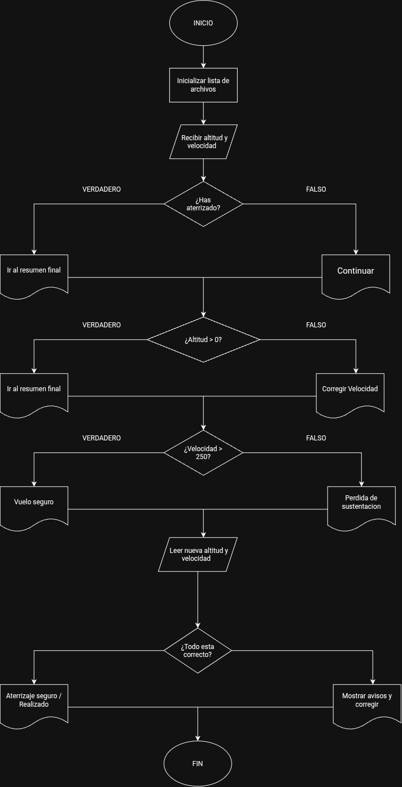

# Clase 11 de Agosto / 2026

## Taller de Algoritmos:

### Ejercicios con condicionales

### 1) **Verificación de peso de despegue:**
    
- En una pista de pruebas de aeronaves, el sistema debe verificar si el peso total de la aeronave, incluyendo combustible y carga, supera el límite máximo permitido para el despegue. Dependiendo del resultado, el sistema deberá indicar si la aeronave está lista para despegar o si debe reducir carga o combustible.

### 2) **Control de temperatura del motor:**

- Durante una inspección de rutina, se mide la temperatura de un motor de turbina. Si la temperatura es mayor a un valor crítico, se debe indicar "Peligro: sobrecalentamiento". Si está dentro del rango seguro, indicar "Operación normal". Si es demasiado baja, indicar "Motor frío – Calentar antes de operar".

 # Ejercicios de Bucles

### 1) Registro de altitudes de vuelo:
    
   Un sistema debe registrar la altitud de vuelo cada 10 minutos durante una hora y mostrar todas las mediciones al final.

### Solución:

Inicio
  
   (Cont / Contador) = 0
   Leer nivel
   Mientras nivel ≥ max 0.1
 
Cont = Cont + 1
         Leer nivel
   Fin - Mientras
Mostrar "Tiempo transcurrido" cont
Fin

### 2) Control de combustible en pruebas:
    
   Durante un ensayo en banco de un motor a reacción, se mide el nivel de combustible cada minuto y se detiene el registro cuando el combustible baja del 10%. Mostrar el tiempo total de operación antes de llegar a ese punto.

### Solución:

Inicio

   Cont = 0
   Leer temp
Mientras cont < 12
      
Si temp > 27 o temp < 18
         Mostrar "Activar climatización"
      Fin si: cont = cont + 1
   Fin mientras
   Fin

   # Ejercicios con Bucle y Condicionales

### 1) **Detección de turbulencia en trayecto:**
    
   Un sensor mide la aceleración vertical de la aeronave en intervalos de un segundo durante un trayecto de 2 minutos. Si el valor medido supera un umbral, indicar que se ha detectado turbulencia en ese instante. Al final, mostrar cuántas turbulencias se detectaron.

### 2) **Control de temperatura en cabina**
    
   Un sistema mide cada 5 minutos la temperatura en cabina durante una hora. Si en algún momento se detecta una temperatura mayor a 27°C o menor a 18°C, debe indicar que se active el sistema de climatización.   

### 3) **Simulación de conteo de pasajeros**
    
   Durante el abordaje, un sistema cuenta a los pasajeros que ingresan. Si el número total supera la capacidad máxima, el sistema debe detener el conteo y mostrar un mensaje de alerta.

# Ejercicios de mayor complejidad

 ### 1) **Planificación de misión satelital**
    
   Desarrollar un algoritmo que reciba datos de consumo de energía por hora de un satélite durante un día completo. Si en cualquier hora el consumo excede un límite crítico, debe registrarse como una alerta. Al final, mostrar el consumo total y el número de alertas generadas.

### 2) **Simulación de carga y balanceo de aeronave**
    
   Una aeronave tiene varias bodegas de carga. El sistema debe permitir ingresar el peso cargado en cada bodega y verificar que:
    
   - El peso total no exceda el máximo permitido.
    - Ninguna bodega individual supere su límite.
        
        Mostrar mensajes de advertencia si alguna condición no se cumple.

### 3) **Monitoreo de aproximación a pista**
    
Durante la aproximación, un sistema recibe datos de altitud y velocidad cada 5 segundos hasta el aterrizaje. Si la velocidad excede el valor máximo seguro o la altitud no desciende adecuadamente, debe indicarse un mensaje de corrección de maniobra. Mostrar un resumen final de todos los avisos emitidos.

